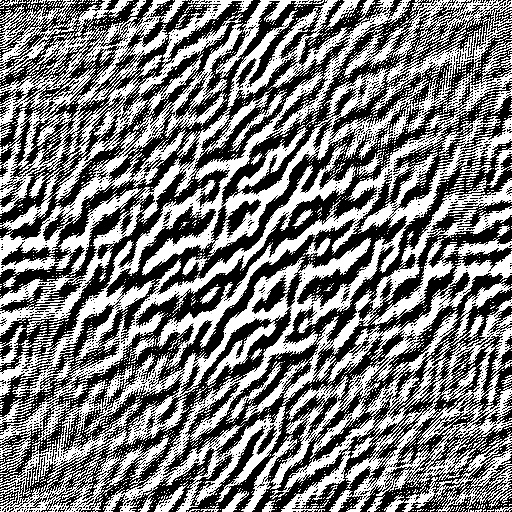
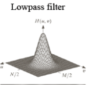
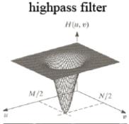

# DIP课程设计报告
## FFT
### 一些小小的概念

- 多项式：就是在一个代数域上存在下面的形式和。
$$A(x) = \sum_{j=0}^{n-1}{a_jx^j}$$
那么，我们可以对这个多项式进行多种的操作，比如，我们可以对两个多项式进行加法的操作。对两个n次的多项式A(x),B(x)求和可以采用下面的式子：
$$c_x = a_x+b_x$$
也就是说，我们可以在线性时间的复杂度内得到两个多项式的和。

那么，对于多项式的乘法，我们又应该怎么做呢？
首先，我们回忆起了小学就学过的乘法竖式，我们可以得到两个多项式相乘的结果的系数方程：
$$c_x = \sum_{j=0}^{x}a_j*b_{x-j}$$
很显然，如果要这样计算的话，我们会在$O(n^2)$的时间复杂度下得到结果。
那么，我们可不可以简化这个操作的复杂度呢？

#### 多项式的表示方法

- 系数表达：我们可以将n次多项式的系数写成两个n维的向量。那么，很显然的两个操作，多项式加法可以表示成为两个向量的相加。多项式的乘法就很显然是这两个向量的卷积。

- 点值表达：一个次数为$n-1$的多项式可以由n个点组成的集合而构成。其中，n个点的横坐标$x_i$各不相同。
我们可以采用线性插值 的方法来从一个点集得到一个给定次数的多项式。
证明方法：
- 利用范德蒙德行列式的奇异性质来进行证明。
- 使用反证法，首先证明存在这样的多项式，再假设存在多个这样的多项式，推理得出矛盾。

在点值表达的情况下，我们如果求两个多项式的加法结果，那么我们只是需要n个点，如果是乘法，很显然，我们需要(n+m)个点。

快速乘法的大体框架
- 加倍次数界(Zero Padding)
- 求值，通过FFT，求出A(x),B(x)长度为2n的点值表达。
- 插值：使用逆FFT，求出多项式的值。

#### DFT & FFT

- 单位复数根：为了快速的求解一个多项式的点值表示，我们引入了一个叫做单位复数根的概念。所谓单位复数根，就指的是满足$w^n=1$的所有的复数根。通过欧拉万能公式 我们可以知道：
$$e^{iu}=cos(u)+i*sin(u)$$
所以此时我们知道$u=2k\pi$
解之，我们可以得到下面的这个式子：$w_n=e^{\frac{2\pii}{n}}$

一些关于这个结果的结论：
结论1：$w_{dn}^{dk}=w_n^k$
结论2：$w_n^{n/2}=w_2=-1$
结论3：若n>0,且n=2*k, 那么n个n次单位复数根的集合就是n/2个n/2次单位复数根的集合。

回到我们要求的式子，我们发现:
$$A(x)=\sum_{j=0}^{n-1}a_jx^j$$
只要带入单位复数根，就可以得到相应的解了。

于是，我们就得到了FFT的一种递归的算法：

```
Recursive_FFT(a):
    Len = a.length()
    if Len == 1:
        return a
    wn = exp(2*pi*i/n)
    w = 1
    a0 = (a[0],...,a[n-2])
    a1 = (a[1],...,a[n-1])
    y0 = Recursive_FFT(a0)
    y1 = Recursive_FFT(a1)

    for k=0 to Len/2-1:
      y[k] = y0[k]+wy1[k]
      y[len/2-1+k] = y0[k]-wy1[k]
      w = wwn
return y
```


FFT的一种迭代的实现
蝴蝶操作，我们可以发现$ww_n$被反复的利用了，所以我们可以将其存储下来。
然后，我们作出FFT递归调用的递归树，我们可以发现一些十分有趣的事情：
我们可以自底向上的考虑这样的一棵递归树。
我们就可以惊喜的发现，实际上从叶子结点开始算起的话，叶子节点计算的顺序就是其标号的二进制的转置。我们可以得到下面的迭代算法：

</img>

```
Iterative_FFT(a):
     n = a.length

    //calculate the bitwise reverse
    for i = 0 to n-1:
      A[rev(i)] = a[i]

    for i = 1 to lgn:
      m = 2^i
      wi = exp(2*pi*i/m)
      for k = 0 to n-1 by m
        w = 1
        for j = 0 to m/2-1:
          t = wA[k+j+m/2]
          u = A[k+j]
          A[k+j] = u+t
          A[k+j+m/2] = u-t
          w = wwm
  return A
```


FFT处理的一个简单的应用

在工业界对FFT的一个简单的应用就是大整数乘法。我们知道一个十进制的大整数可以表示成下面的形式：
$$A = \sum_{i=0}^N-1a_i*10^i$$
那么，根据我们小学的时候所学到的数学的知识，结合我们刚才所得到的结论，我们惊奇的发现，所谓的大整数乘法，其实就这一表示成为两个多项式之间的卷积。很显然，通过我们所学到的知识，我们可以清楚的知道，我们想要得到两个大整数的乘积，其计算复杂度就是$O(n^2)$, 这个结论同时也可以通过分析小学的时候我们的乘法竖式来得到。
下面，我们给出了计算两个大整数乘法的较快的算法：

```
// To return the results of two big numbers
BigNumber_mul(A,B):
    //transfor the two numbers to array
    a_num = transfor(A)
    b_num = transfor(B)
    a_transfor = FFT(a_num)
    b_transfor = FFT(b_num)

    for i = 0 to max(a.length,b.length):
        res[i] = a_transfor[i]*b_transfor[i]
    return res
```


很显然，这个算法的时间复杂度就是$O(nlgn)$, 其中n就是数的长度。这样的话，我们就大大提高了计算两个大整数乘积的时间复杂度。
附件中也有计算两个大整数的高效算法的实现，使用这段程序，可以完成长度为10000以内的大整数的乘法操作。

FFT 在图像处理中的应用

FFT，作为对函数转化的利器，在图像处理中也有着十分重要的应用。我们一般看图像，是一个一个像素点的集合。但是，在图像处理当中，一个十分重要的思想就是将一个图像当作二维的矩阵来处理。更进一步的，我们的图像本质上就是一个我们经常见到的二元函数，其定义如下：
$$F(x,y)=A_{xy}$$
其中x是横坐标，y是纵坐标。

那么，也就是说，我们实际上要做的，就是对一个二元函数进行一次FFT变换。这样的变换是如何进行的呢？让我们首先写出二维DFT变换的函数：
$$FFT(x,y)=\sum_{m=0}^{M-1}\sum_{n=0}^{N-1}f(m,n)e^{-j2\pi(x\frac{m}{M}+y\frac{n}{N})}$$
这个样子的话，我们就用数学的方法对这个函数进行一些简单的变换：
$$FFT(x,y)=\sum_{m=0}^{M-1}e^{-2j\pi(x\frac{m}{M})}\sum_{n=0}^{N-1}f(m,n)e^{-j2\pi(y\frac{n}{N})}$$
这样，我们要做的事情就十分清楚了，我们首先按行进行一次FFT，再对第一次FFT的结果按列进行一次FFT的操作，我们就可以得到这个二维方程的FFT。具体的伪代码如下所示：

```
FFT_2D(Image):
    //Do FFT from top to bottom
    for i = 0 to Image.Height:
      Image[i] = FFT(Image[i])
      //Transpose this image
    Transpose(Image)
    for i = 0 to Image.Height:
      Image[i] = FFT(Image[i])
    Transpose(Image)
```


但是，对这个图像进行的FFT变换到底有怎么样实际的意义呢？
我们通过对一元函数的分析，知道了一点是，傅立叶变换可以使得一个多项式从基础的多项式表达转化成为点集的表达。通过线性插值我们又可以将这个函数转化成为原来的样子。对这样一个二维的函数做这样的操作，会产生怎样的效果呢？
使用FFT，我们可以将原来的灰度图转化成我们所想要的频域图。而其逆向变换就是将一个频域图转化成为了灰度分布图。通过灰度分布图，我们可以清楚的发现图像频率的变化情况。也为我们下一步的操作提供了很大的方便。
我们可以使用阻滞滤波对原来的图形进行降噪的工作。当然，这样的工作在灰度图的情况下我们也是可以做的。但是很不幸的是，要达到这一点我们必须要进行卷积的操作。而这样的操作我们已经知道了，其时间复杂度是非常大的。如果进行了FFT变换，我们可以发现，在规模非常大的情况下，我们的计算复杂度大大降低了。这就是使用FFT的好处。
我们又惊奇的发现，我们现在所面对的情况，和我们在做大整数乘法时我们不得不面对的情况，是多么的相似啊。我们在进行大整数乘法的时候，首先将我们熟悉的乘法竖式的情况转化成了我们现在所接触的卷积。然后再想办法使用FFT将本来要进行的十分复杂的卷积变成了简单的乘法。而在进行图像处理的时候，我们只不过把一元函数的情况推向了二维。虽然看起来做的事情大不相同，但是我们通过一步一步的学习和仔细分析，我们就可以清楚的发现，我们一直以来所要做的事情，其本质都是一样的。

项目的组成部分

我的项目主体是由Python写成的。主要使用了下面的这些第三方模块：
numpy: 一个python的科学计算函数库
opencv:一个图像处理的类库
然后，主要包括下面的这些主体模块：
Complex.py:
因为傅立叶变换中，我们需要复数操作，所以，这主要是一些复数的基本操作。
- Complex(self, real, image), 通过传入的参数构造复数
- Complex(self) 构造0复数
- add：重载操作符，进行复数加法
- sub：重载操作符，进行复数减法
- mul：重载操作符，进行复数乘法

BigNumber.py:
实现了一个进行大整数乘法的库，主要包括下面的这些方法。
- Transfor(number): 将一个大整数转化成为复数形式
- Mul(numbera,numberb): 进行两个大整数的乘法
- Output(number): 输出这个大整数
- Main: 一个主控制台，负责输入数据和调用其他的模块进行处理

FFT.py：
主体的模块，实现了具体的FFT算法
- FFT(array): 实现了一维的FFT算法
- FFT_Inverse(array): 实现了一维的逆FFT算法

Image_Processing.py:
图像处理的一些操作
- Transpose(Matrix): 将一个矩阵转置，返回结果
- Image_FFT(Image): 将图像转化成为频域的形式
- Image_FFTInverse(Image): 图像的逆FFT变换
- LowBanwidth(Image): 进行低通滤波的处理
- HighBanwidth(Image): 进行高通滤波的处理
- Output(filename): 按照文件名保存图像
- InputFromFile(filename): 按照文件名访问图像，不存在则提示

#### 一些实例
通过上面的论述，我们知道了，我们可以通过FFT将本来十分复杂的卷积操作转化成为我们所熟悉的乘法操作。而在项目的例子里，我使用FFT处理一个图片。
首先，原来的图片如下面所示:  
</img>
我们对这个图片进行了一次FFT处理，得到的频域图如下所示:  
</img>
而后，我们又使用了如下面图所示的低通滤波函数对这张频域图进行了处理：
</img>
得到的效果如下所示:  
</img>
再后，我们使用了高通滤波对这张图进行了处理，函数图像如下所示:  
</img>
得到的效果如下所示:  
</img>


### 感悟

这个项目实际上是我对FFT的学习。我觉得，通过这个过程，我学习到了一些十分重要的道理。
1. 首先，很多看起来不相关的工作，实际上依赖的基础工作类似。在日常学习的过程当中，需要通过表面的现象追求其深层次的本质。这样做能够大大提高学习的效率。
2. 计算机科学一个十分重要的思维就是增量式的思维，我们不是从一个很低的位置极快的上升到很高的位置，而是从前面的研究成果中不断改进得到新的结果。这个思维，无论在工业界还是研究界都是适用的。

### 参考文献

[1]Cormen, Thomas H.; Leiserson, Charles E.; Rivest, Ronald L.; Stein, Clifford (2009) [1990]. Introduction to Algorithms (3rd ed.). MIT Press and McGraw-Hill.   
[2]Rafael C.Gonzalez, Richard E.Woods Digital Image Processing (2011). Publishing House Of Electronics Industry
